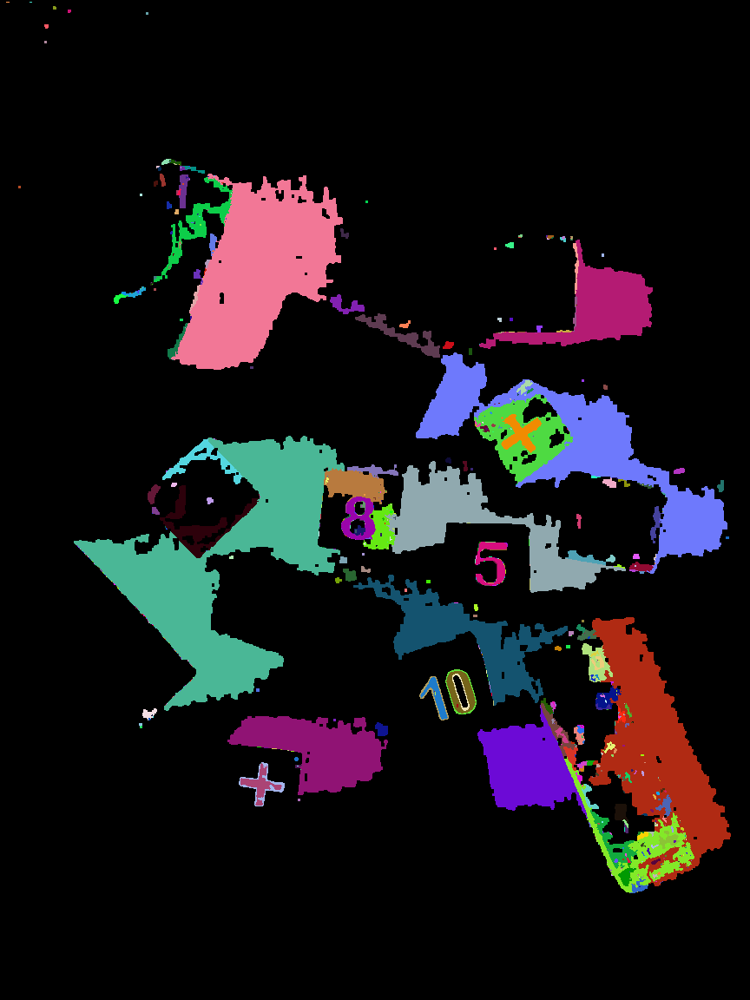
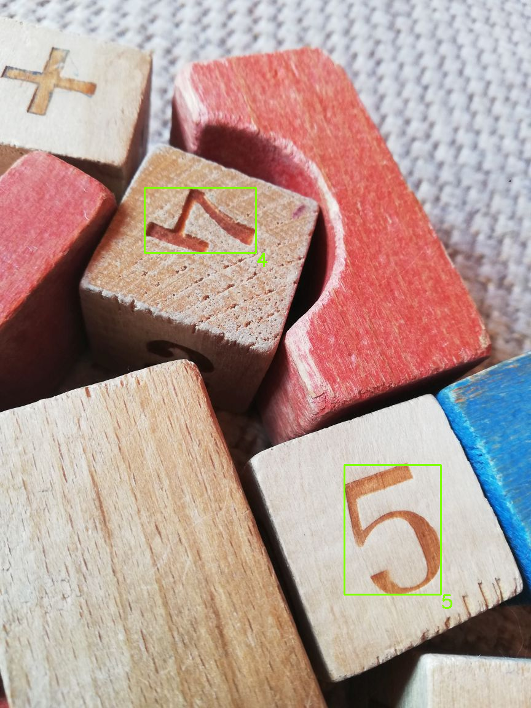
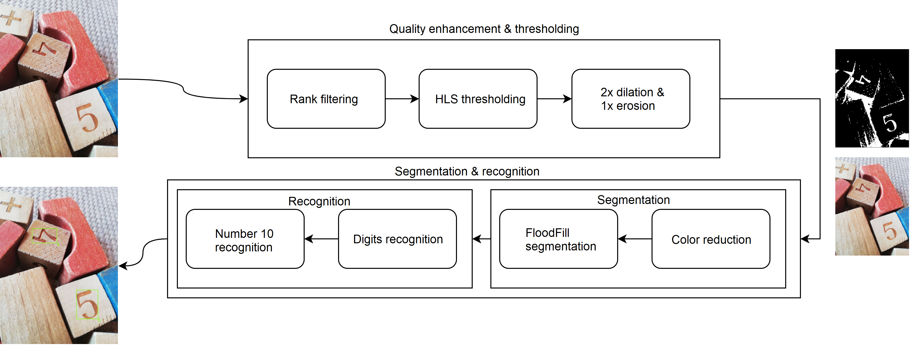

# POBR - projekt

 **PL**

Autor: Sławomir Nikiel

Tematem projektu jest implementacja programu rozpoznającego numery na drewnianych klockach. Rozpoznawanie zrealizowane jest za pomocą klasycznych metod przetwarzania obrazów oraz klasyfikacji obiektów. Sam program zaimplementowany jest w języku C++. Wszystkie kluczowe algorytmy  wykorzystywane w rozwiązaniu zawarte są w kodzie źródłowym, wspierają je struktury danych zawarte w bibliotece OpenCV.

## Rozwiązanie

Rozwiązanie przedstawionego problemu jest procesem wieloetapowym. Można z niego wydzielić dwie podstawowe fazy. Fazę poprawy jakości i progowania oraz fazę segmentacji i rozpoznawania. Ogólny przepływ obrazu w aplikacji przedstawiony jest na poniższym diagramie. 

### Poprawa jakości i progowanie

Poprawa jakości wejściowego obrazu odbywa się z użyciem filtracji rankingowej. Użycie tego rodzaju filtra ma na celu zmniejszenie wpływu niedoskonałości oraz naturalnych cech materiału, czyli drewna, z którego wykonane są klocki. Po przefiltrowaniu obrazu poddawany jest on progowaniu. Odbywa się ono w przestrzeni barw HLS i obejmuje wszystkie jego trzy kanał. Progowanie ma na celu wygenerowanie maski binarnej wyodrębniającej poszukiwane cyfry. Niestety sama ta metoda jest niewystarczająca i została wsparta inną w dalszej fazie przetwarzania. Następnie maska przepuszczana jest przez trzy filtry morfologiczne, podwójną dylację oraz erozję. W ten sposób uzyskiwany jest obraz binarny o większej ciągłości. Tak przygotowana maska oraz obraz wynikowy filtracji rankingowej przekazywane są do kolejnego etapu przetwarzania.

### Segmentacja i rozpoznawanie

Na podstawie wcześniej wspomnianej maski oraz kolorowego obrazu otrzymanego po filtracji rankingowej wykonywana jest segmentacja obrazu. Przed samą segmentacją przeprowadzana jest redukcja ilości kolorów przefiltrowanego obrazu, co pozytywnie wpływa na wyniki segmentacji. Segmentacja odbywa się algorytmem FloodFill z uwzględnieniem kanału V przestrzeni barw HSV. Segmenty wydzielane są na podstawie spójności obszarów binarnej maski oraz progowania kanału V pikseli. Taka metoda pozwala wyodrębnić poszczególne cyfry nawet w przypadku, gdy nie zostały one całkowicie odseparowane za pomocą maski. Poniższy obraz przedstawia wygenerowaną w opisany sposób mapę segmentów.

Podczas generowania mapy tworzone są obiekty poszczególnych segmentów, które następnie przekazywane są do fazy rozpoznawania. W fazie rozpoznawania segmenty poddawane są klasyfikacji na podstawie odpowiednich zestawów momentów geometrycznych. W ten sposób rozpoznawane są poszczególne cyfry na klockach. W celu rozpoznania liczby 10 analizowane są wszystkie pary cyfr 1 i 0. Analiza ta polega na łączeniu chmur punktów zadanych segmentów, a następnie testowaniu, za pomocą momentów geometrycznych, tak nowopowstałego segmentu pod kątem reprezentowania liczby 10. Po wykonaniu wszystkich opisanych wcześniej etapów przetwarzania zadanego obrazu uzyskuje się wystarczające dane do zaprezentowania wyników, których przykład znajduje się na kolejnym obrazie.

 **ENG**

Author: Sławomir Nikiel

The subject of the project is to implement a programme recognising numbers on wooden blocks. Recognition is realised using classical methods of image processing and object classification. The program itself is implemented in C++ language. All key algorithms used in the solution are included in the source code, they are supported by data structures included in the OpenCV library.

## Solution

Solving the presented problem is a multi-stage process. Two basic phases can be separated from it. The quality improvement and thresholding phase and the segmentation and recognition phase. The overall image flow of the application is shown in the diagram below. 

### Quality improvement and thresholding

Improving the quality of the input image is done using ranking filtering. The use of this type of filter is intended to reduce the influence of imperfections and the natural characteristics of the material, i.e. the wood from which the blocks are made. After the image has been filtered, it is subjected to thresholding. This is done in the HLS colour space and covers all three channels of the image. The purpose of thresholding is to generate a binary mask that extracts the desired digits. Unfortunately, this method alone is insufficient and is supported by another one in the further processing phase. The mask is then passed through three morphological filters, double dilation and erosion. In this way a binary image with greater continuity is obtained. The mask thus prepared and the resultant image of the ranking filtering are passed to the next processing stage.

### Segmentation and recognition

Based on the previously mentioned mask and the colour image obtained after ranking filtering, image segmentation is performed. Before the segmentation itself, a reduction of the number of colours of the filtered image is performed, which positively influences the segmentation results. Segmentation is performed with the FloodFill algorithm taking into account the V channel of the HSV colour space. Segments are separated on the basis of binary mask area consistency and V-channel thresholding of pixels. This method allows to extract individual digits even if they were not completely separated by the mask. The image below shows the segment map generated in the described way.

When the map is generated, individual segment objects are created, which are then passed to the recognition phase. In the recognition phase, the segments are classified on the basis of appropriate sets of geometric moments. In this way, the individual numbers on the blocks are recognised. In order to recognise the number 10, all pairs of digits 1 and 0 are analysed. This analysis consists of merging the point clouds of the given segments and then testing, using geometrical moments, the newly created segment for the representation of the number 10. After all the previously described stages of processing the given image, sufficient data is obtained to present the results, an example of which can be found in the next image.

Translated with www.DeepL.com/Translator (free version)
